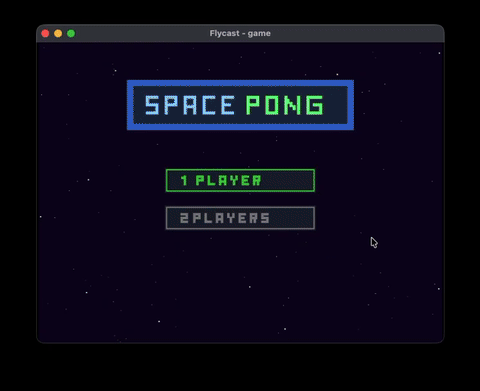
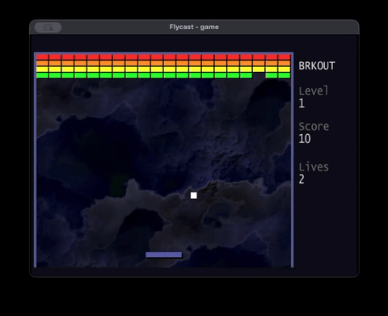
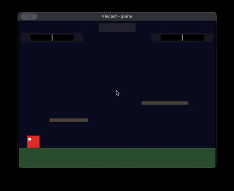

# libgodc - Go runtime for Sega Dreamcast

<p align="center">
  
</p>

<p align="center">
  
  
  
</p>

Replaces the standard Go runtime with one designed for the Dreamcast's
constraints: memory 16MB RAM, CPU single-core SH-4, no operating system. Provides garbage
collection, goroutines, channels, and the core runtime functions.

## Quick Start

**Prerequisites:** Go 1.25.3+, `make`, and `git` must be installed.

```sh
go install github.com/drpaneas/godc@latest
godc setup
godc doctor # to check (optional)
```

> **Note:** The [`godc`](https://github.com/drpaneas/godc) CLI tool is a separate project that handles toolchain setup and builds.

Create and run a project:

```sh
mkdir myproject && cd myproject
godc init
# write your main.go and other *.go files
godc build
godc run
```

See the [Quick Start Guide](https://drpaneas.github.io/libgodc/getting-started/quick-start.html) for your first program.

## Documentation

📚 **[Full Documentation](https://drpaneas.github.io/libgodc/)**

- [Installation](https://drpaneas.github.io/libgodc/getting-started/installation.html) — Setup and configuration
- [Quick Start](https://drpaneas.github.io/libgodc/getting-started/quick-start.html) — First program walkthrough
- [Design](https://drpaneas.github.io/libgodc/reference/design.html) — Runtime architecture
- [Effective Dreamcast Go](https://drpaneas.github.io/libgodc/reference/effective-dreamcast-go.html) — Best practices
- [KOS Wrappers](https://drpaneas.github.io/libgodc/reference/kos-wrappers.html) — Calling C from Go
- [Limitations](https://drpaneas.github.io/libgodc/reference/limitations.html) — What doesn't work

## Performance

The repo includes `tests/bench_architecture.go` for measuring runtime behavior
on Dreamcast hardware.

| Benchmark | What it reports |
|-----------|-----------------|
| `gosched` | Nanoseconds per yield |
| Buffered channel | Nanoseconds per buffered operation |
| Context switch | Nanoseconds per goroutine switch |
| Unbuffered channel | Nanoseconds per roundtrip |
| Goroutine spawn | Nanoseconds per spawn/run cycle |
| GC pause | Microseconds per forced collection across retained sizes from 32 KB to 1 MB |
| Memory layout | Stack size, context size, header size, and large-object threshold |

Run `tests/bench_architecture.elf` on your hardware for current numbers.

## Examples

The `examples/` directory contains working programs:

- `hello` — Minimal program (debug output)
- `hello_screen` — Hello World on screen using BIOS font
- `blue_screen` — Minimal graphics
- `input` — Controller input
- `goroutines` — Concurrent bouncing balls
- `channels` — Producer/consumer pattern
- `timer` — Frame-rate independent animation
- `bfont` — BIOS font rendering
- `filesystem` — Directory browser
- `vmu` — VMU LCD and buzzer
- `brkout` — Breakout clone (GPL v2, port of Jim Ursetto's original)
- `platformer` — Side-scrolling platformer
- `pong` — Pong clone with 1P/2P mode, particle effects, and AI

## License

BSD 3-Clause License. See [LICENSE](LICENSE) for details.
