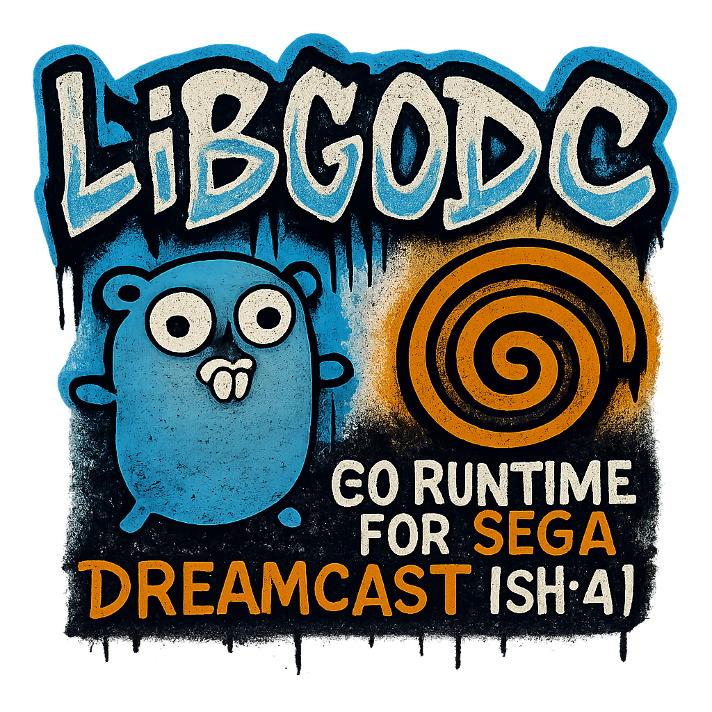

# libgodc

<p align="center">
  
</p>

Welcome to **libgodc** — a minimal Go runtime implementation for the Sega Dreamcast.

This project brings the Go programming language to a 1998 game console with 16MB of RAM, a 200MHz SH4 processor, and absolutely no operating system to speak of. It's an exercise in constraints, a love letter to retro hardware, and a deep dive into how programming languages actually work under the hood.

## What is libgodc?

libgodc replaces the standard Go runtime (libgo) with one designed for the Dreamcast's unique constraints:

| Feature | Desktop Go | libgodc |
||||
| Memory | Gigabytes | 16 MB total |
| CPU | Multicore GHz | Singlecore 200 MHz |
| Scheduler | Preemptive | Cooperative |
| GC | Concurrent tricolor | Stoptheworld semispace |
| Stacks | Growable | Fixed 64 KB |

Despite these differences, you write normal Go code. Goroutines work. Channels work. Maps, slices, interfaces  they all work. The magic is in the runtime.

## Who is this for?

 **Systems programmers** curious about runtime implementation
 **Go developers** who want to understand what happens below `go run`
 **Retro enthusiasts** who think game consoles deserve modern languages
 **Anyone** who enjoys the challenge of severe constraints

## Prerequisites

Before diving in, you should be comfortable with:

| Skill | Level | Why You Need It |
||||
| **Go** | Intermediate | Variables, functions, structs, goroutines, channels |
| **C** | Basic | Pointers, memory layout, basic syntax |
| **Command line** | Comfortable | Building, running, navigating directories |

You **don't** need to know:

 Assembly language (we'll explain what you need)
 Dreamcast hardware (KallistiOS handles the hard parts)
 Garbage collection algorithms (we'll build one together)
 Operating system internals (we'll cover what's relevant)

If you can write a Go program that uses goroutines and channels, and you know what a pointer is in C, you're ready.

## What's in this book?

### Getting Started

Installation, toolchain setup, and your first Dreamcast Go program.

### The Book

A complete walkthrough of building a Go runtime from scratch:

 Memory allocation and garbage collection
 Goroutine scheduling without threads
 Channel implementation
 Panic, defer, and recover
 Building real games

### Reference

Technical documentation for daily use:

 API design
 Best practices
 Hardware integration
 Known limitations

## Quick Example

```go
package main

import "kos"

func main() {
    kos.PvrInitDefaults()
    
    for {
        kos.PvrWaitReady()
        kos.PvrSceneBegin()
        kos.PvrListBegin(kos.PVR_LIST_OP_POLY)
        // draw stuff here
        kos.PvrListFinish()
        kos.PvrSceneFinish()
    }
}
```

This runs on a Dreamcast. Real hardware. 1998 technology. Go code.

## Getting Started

Ready to begin? Head to the [Installation](getting-started/installation.md) page.

Or if you want to understand the full journey, start with [Chapter 0: Building From Nothing](book/chapter_00_building_from_nothing.md).

<div style="textalign: center; color: #888; paddingtop: 2em;">
"Console development is the art of saying 'no' to malloc."
</div>

